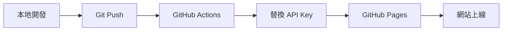

# 台北捷運夜市地圖

一個互動式的台北捷運夜市地圖，顯示各大夜市的位置和對應的捷運站。

## 🚀 快速開始

### 本地開發

1. **複製配置文件**
   ```bash
   cp config.sample.js config.js
   ```

2. **設定 Google Maps API Key**
   - 編輯 `config.js` 文件
   - 將 `YOUR_ACTUAL_API_KEY_HERE` 替換為您的實際 API Key

3. **啟動本地服務器**
   - 使用 VS Code Live Server 擴展
   - 或任何其他靜態文件服務器

### 獲取 Google Maps API Key

1. 前往 [Google Cloud Console](https://console.cloud.google.com/)
2. 創建或選擇項目
3. 啟用 **Maps JavaScript API**
4. 創建 **API Key**
5. 設定 API Key 限制（建議限制為特定網域）

## 📁 文件結構

```
metro_taipei_night_markets/
├── .github/workflows/
│   └── deploy.yml          # GitHub Actions 部署配置
├── config.sample.js        # 配置文件範例
├── config.js              # 實際配置文件（不提交到 Git）
├── env-loader.js          # 環境變數載入器
├── index.html             # 主要 HTML 文件
├── .gitignore             # Git 忽略文件
└── README.md              # 說明文件
```

## 🌐 部署到 GitHub Pages

### 啟用 GitHub Pages

1. **前往您的 GitHub 倉庫頁面**
2. **點擊 Settings 標籤**
3. **在左側選單中找到 "Pages"**
4. **在 "Source" 部分選擇 "GitHub Actions"**

### 設定部署

1. **設定 GitHub Secret**
   - 前往倉庫 Settings → Secrets and variables → Actions
   - 點擊 "New repository secret"
   - Name: `GOOGLE_MAPS_API_KEY`
   - Secret: 您的 Google Maps API Key
   - 點擊 "Add secret"

2. **推送代碼**
   ```bash
   git add .
   git commit -m "Add night market map"
   git push origin main
   ```

3. **自動部署**
   - GitHub Actions 會自動執行部署
   - 前往 Actions 標籤查看部署狀態
   - 部署完成後，您的網站將在 `https://username.github.io/repository-name` 可用

## ⚙️ 技術架構

### 核心技術

- **前端框架**：純 HTML5 + CSS3 + JavaScript (ES6+)
- **地圖服務**：Google Maps JavaScript API
- **部署平台**：GitHub Pages
- **CI/CD**：GitHub Actions

### 使用的 API 和服務

| 技術 | 用途 | 版本/類型 |
|------|------|-----------|
| **Google Maps JavaScript API** | 地圖顯示、標記、導航 | v3 |
| **Google Maps Search API** | 點擊導航功能 | v1 |
| **GitHub Pages** | 靜態網站託管 | - |
| **GitHub Actions** | 自動化部署 | v4 |

### 技術特點

- **零依賴**：不使用任何第三方 JavaScript 框架
- **輕量化**：單一 HTML 文件，載入速度快
- **響應式**：CSS Grid 和 Flexbox 佈局
- **模組化**：配置與邏輯分離
- **安全性**：API Key 環境變數管理

## 🗺️ 功能特色

- **互動式地圖**：使用 Google Maps API
- **夜市標記**：顯示 22 個台北知名夜市
- **捷運線色彩**：標記顯示對應的捷運線顏色
- **點擊導航**：點擊夜市標記可開啟 Google Maps 導航
- **響應式設計**：適配各種螢幕尺寸

## 🎨 自訂設定

編輯 `config.js` 可以調整：

- **地圖中心點和縮放等級**
- **地圖樣式**（roadmap, satellite, hybrid, terrain）
- **應用程式標題**
- **除錯模式**

## 🔧 開發說明

### 添加新夜市

在 `index.html` 的 `nightMarkets` 陣列中添加：

```javascript
{
    name: "夜市名稱",
    coords: { lat: 緯度, lng: 經度 },
    station: "捷運站名 (線路代碼)"
}
```

### 捷運線顏色

支援的捷運線代碼和顏色：
- `G`: 松山新店線（綠色 #008659）
- `R`: 淡水信義線（紅色 #E3002C）
- `BL`: 板南線（藍色 #0070BD）
- `O`: 中和新蘆線（橘色 #F8B61C）
- `BR`: 文湖線（棕色 #C48A31）
- `Y`: 環狀線（黃色 #FFDB00）

### API 使用說明

#### Google Maps JavaScript API
```javascript
// 地圖初始化
const map = new google.maps.Map(document.getElementById("map"), {
    center: { lat: 25.0330, lng: 121.5654 },
    zoom: 12
});

// 自訂標記覆蓋層
class CustomLabel extends google.maps.OverlayView {
    // 實現自訂標記邏輯
}
```

#### 導航功能
```javascript
// Google Maps Search API 導航
const searchUrl = `https://www.google.com/maps/search/?api=1&query=${encodeURIComponent(market.name + " " + market.coords.lat + "," + market.coords.lng)}`;
```

### 環境配置系統

專案支援多種配置方式：

1. **本地開發**：`config.js` 文件
2. **GitHub Actions**：環境變數 `GOOGLE_MAPS_API_KEY`
3. **URL 參數**：`?apikey=YOUR_API_KEY`（測試用）

### 部署架構



## 📝 注意事項

- **不要提交 `config.js`** 到版本控制系統
- **設定 API Key 使用限制** 以避免濫用
- **定期檢查 API 使用量** 避免超出免費額度
- **使用 HTTPS** 確保 API 請求安全

## 🤝 貢獻

歡迎提交 Issue 和 Pull Request！

## 📄 授權

MIT License
